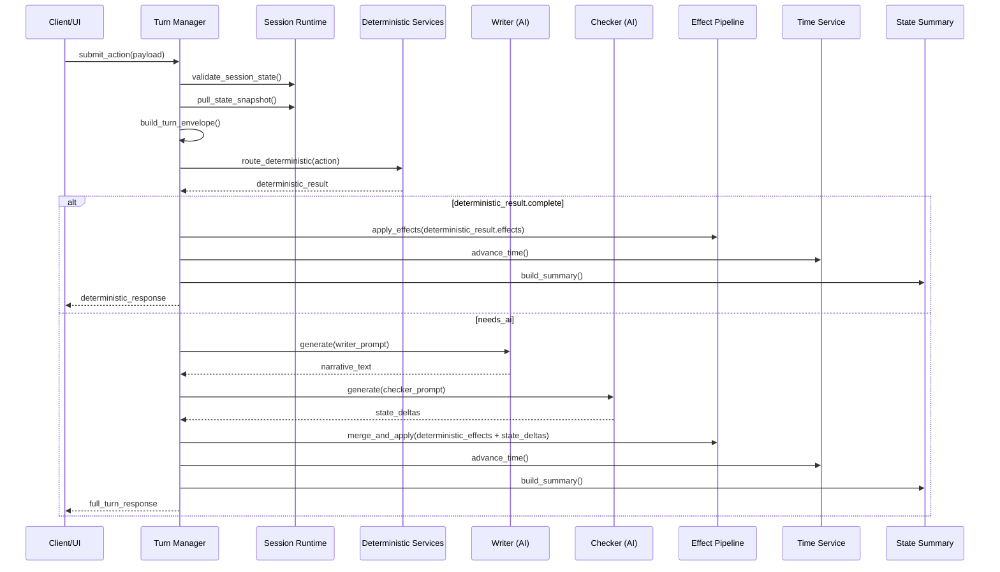
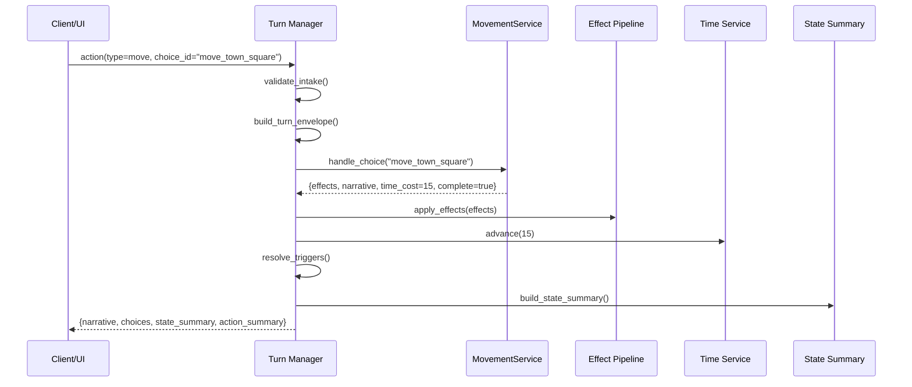
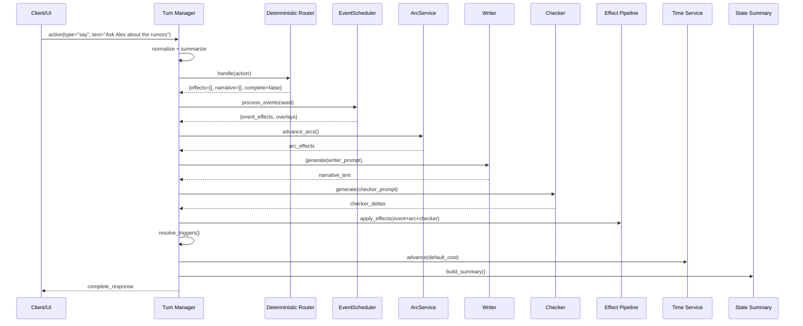

# PlotPlay Turn Processing Blueprint

This document captures a detailed, implementation-ready view of the unified turn-processing pipeline requested for the refined PlotPlay engine runtime. It expands the current informal flow into concrete phases, highlights subsystem responsibilities, and illustrates the control flow using pseudocode and sequence diagrams. The intent is to guide refactors that reconcile deterministic actions (movement, inventory, clothing, shop, outfit operations) and AI-mediated freeform actions under a single dispatcher.

---

## 1. High-Level Turn Lifecycle

Every incoming action—whether a freeform `say/do`, an authored choice, or a deterministic command—passes through the same orchestration stages.

```text
Intake → Context Assembly → Deterministic Dispatch → (optional) AI Writer → (optional) AI Checker → Effects & Transitions → Time & Modifiers → Choice Rebuild → Response Packaging
```

### Mermaid Overview



---

## 2. Detailed Phase Reference

### 2.1 Pre-Turn Intake
- Ensure session has not reached an `ENDING` node or other terminal guardrail.
- Normalize the incoming payload to one of four action classes:
  - `freeform`: `say` or `do` text that typically requires AI interpretation.
  - `choice`: authored node choice or globally unlocked action.
  - `deterministic`: movement, travel, inventory, clothing, shop, outfit actions (explicit payload).
  - `system`: flags such as `skip_ai` or future undo/redo controls.
- Verify target characters/items exist and are present/accessible; reject illegal requests with immediate failure responses (no state mutation).
- Construct an `action_summary` string for UI/telemetry (used even if AI is skipped).

### 2.2 Context Assembly
- Refresh character presence based on the active node (respecting authored `characters_present`, dynamic discovery lists, and schedules).
- Execute node `on_entry` effects when a transition happened just before this turn; apply via Effect Pipeline to keep state consistent before the player decision.
- Build the **turn envelope** shared by Writer and Checker:
  - Game meta (`meta.id`, spec version).
  - Temporal snapshot (day, slot, clock time, weekday, RNG seed).
  - Location snapshot (zone, privacy, exits, zone connections, shop availability).
  - Node summary (type, title, beats, narration overrides).
  - Player summary (inventory, meters, modifiers, clothing state).
  - Present NPC cards (meters, modifiers, consent gates, refusal lines, wardrobe states).
  - Recent dialogue history, memory log excerpts, last node history.
  - Current UI choices/deterministic buttons (for Writer awareness).

### 2.3 Deterministic Dispatch Layer
- Prioritize deterministic handlers; AI phases only run when deterministic processors do not fully resolve the turn or explicitly request narrative.
- Routing services:
  - **MovementService**: resolves exit traversal, zone travel, companion rules, privacy shifts, travel time costs, discovery of new exits.
  - **InventoryService**: handles item take/drop/give/use, location inventories, stack counts, quest item constraints, hooks for item-based effects.
  - **ShopService**: validates purchases/sales (currency caps, stock, seller/buyer roles), applies merchant modifiers or discounts.
  - **ClothingService / WardrobeService**: manages clothing items, outfits, slot states (intact/opened/displaced/removed), layering rules, consent/privacy enforcement.
  - **PresenceService**: recomputes present characters after movement or scripted triggers to keep later phases accurate.
- Each service returns:
  - `effects`: structured list for the Effect Pipeline (meter changes, goto, unlocks…).
  - `narrative_snippets`: deterministic text describing the outcome (e.g., “You travel to the campus courtyard.”).
  - `ui_updates`: new/removed choices or flags (like disabling exits).
  - `complete`: whether the turn can finish without Writer/Checker.
  - `requires_ai`: flag to force AI narration even after deterministic effects (e.g., hybrid kiss button).
- Deterministic-only turns (movement, shop, clothing) will set `complete=true` and usually `requires_ai=false`; go straight to Post-Turn reconciliation.

### 2.4 Authored Choice Execution
- For node or global choice selections:
  - Evaluate conditional fields (`when`, `when_all`, `when_any`) with expression DSL.
  - Execute `on_select` effects immediately (through Effect Pipeline). This may change location, adjust meters, unlock new actions, advance arcs, or trigger `goto`.
  - If effects push the player to a new node, process `on_exit` of the current node, set new node, run its `on_entry`, and rebuild presence before continuing.

### 2.5 Event & Arc Sweep (Pre-AI)
- `EventScheduler`: evaluate scheduled, random, or conditional events using seeded RNG; respect cooldowns and `once_per_game/day` flags. Inject event effects into the pending effect queue and record narrative overlays.
- `ArcService`: check `advance_when` expressions for every arc stage. On advancement, apply stage `on_enter`/`on_advance` effects, update arc history, potentially unlock endings or new actions. Log transitions for analytics and prompts.
- Update discovery registries (exits, items, characters) so the Writer prompt and UI snapshot reflect the latest knowledge.

### 2.6 AI Writer Phase (Optional)
- If `skip_ai` is false and deterministic services did not set `complete`, generate a Writer prompt:
  - Include the envelope, action summary, relevant beats, consent/privacy reminders, and key memories.
  - Use deterministic `rng_seed` for reproduceable sampling.
- Stream narrative from the Writer (UI may receive chunks). Accumulate the complete text for Checker and history logging.
- Perform quick safeguards (paragraph count, mention of raw state) and warn if guideline violations are detected; the Checker will enforce state rules, but we surface telemetry for debugging.

### 2.7 AI Checker Phase
- Construct Checker prompt with the same envelope + Writer text, asking for the strict JSON contract.
- Execute Checker (non-streaming) with periodic status updates to the UI (via `CheckerStatusGenerator`).
- Parse JSON (catch decode errors). On success:
  - Validate `safety.ok`; if false, record violations (`gate:<id>`, `privacy:<level>`) and discard offending deltas.
  - Normalize meter/inventory/clothing deltas (`+N`, `-N`, `=N` → numeric operations), clamp within defined min/max, drop unknown keys.
  - Process `node_transition` suggestion only if target node is valid and allowed under current conditions.
  - Extract `memory` entries (trim text length, validate character IDs) and append to session memory log (with rolling cap).
- On failure (invalid JSON), log warning and proceed without applying AI deltas.

### 2.8 Effects Application & Node Transitions
- Merge all effect sources (deterministic services, choice `on_select`, events, arcs, Checker deltas) into an ordered batch:
  1. Deterministic service effects
  2. Choice effects
  3. Event/arc effects
  4. Checker deltas
- Feed batch into the Effect Pipeline:
  - Apply meter changes with clamp & audit logging.
  - Update flags, modifiers (add/remove/tick), inventory (add/remove, location swaps), clothing states.
  - Unlock/lock actions, append memory, fire additional events.
  - Handle `goto` transitions atomically: record pending node change, execute `on_exit` of previous node, set new node, run `on_entry`, and guard against infinite loops.
- After effects, re-run node triggers (automated transitions). Allow one loop per turn with guard to prevent runaway trigger chains.
- Recompute character presence for the final node.

### 2.9 Time & Modifier Advancement
- Use `TimeService` to progress the clock or slot based on action cost (movement/travel/time-consuming actions define minutes spent; otherwise default cost). Update day, weekday, `turn_count`.
- Decrement modifier durations by minutes advanced; expire ones at zero and apply `on_expire` hooks.
- Apply continuous time-based dynamics (e.g., energy regen, hunger decay) defined in game manifest.
- Decrement event cooldown timers and mark once-per-period usage locks.

### 2.10 Choice Reconstruction
- With final node and updated state:
  - Rebuild node `choices` (apply DSL conditions, mark disabled ones, attach `skip_ai` hints where appropriate).
  - Rebuild node `dynamic_choices`.
  - Enumerate globally unlocked actions against current state.
  - Request deterministic buttons from services (movement exits, travel destinations, wardrobe, inventory).
  - Ensure duplicates are merged and disabled choices carry reasons (for UI tooltips).

### 2.11 Narrative Assembly
- Compose final narrative text:
  - Lead with event overlays (if any).
  - Append Writer narrative when present; otherwise use deterministic snippets.
  - Incorporate refusal/consent messages or system warnings when safety violations occurred.
- Append trimmed narrative to `state.narrative_history` (maintain bounded history for prompt context).
- Record analytics (turn duration, Writer/Checker latency, events fired).

### 2.12 Response Packaging
- Generate `state_summary` via `StateSummaryService`:
  - `snapshot`: time, location, exits, zone connections, player inventory, character states (meters, modifiers, clothing), economy info.
  - `action_summary`: textual recap of the player’s action.
  - Flags like `time_advanced`, `location_changed`.
- Construct final response:
  - Streaming: emit sequential events (`action_summary`, `narrative_chunk`, `checker_status`, `complete`).
  - Synchronous: return `GameResponse`/`DeterministicActionResponse` with `choices`, `narrative`, `state_summary`, `action_summary`, optional `details`.
- Persist updated session state through `StateManager` for the next turn.

---

## 3. Unified Dispatcher Pseudocode

```python
async def run_turn(action: PlayerAction) -> TurnResult:
    # 1. Guard rails
    state = runtime.state_manager.state
    current_node = runtime.get_current_node()
    if current_node.type == NodeType.ENDING:
        return TurnResult.ending(state_summary=build_summary(state))

    # 2. Normalize & summarize action
    normalized = normalize_action(action)
    action_summary = state_summary.build_action_summary(normalized.to_text())

    # 3. Context/pre hooks
    refresh_presence(current_node, state)
    apply_node_entry_if_needed(current_node, state)
    turn_envelope = build_turn_envelope(state, current_node, normalized, action_summary)

    # 4. Deterministic routing
    det_result = deterministic_router.handle(normalized, state)
    pending_effects = det_result.effects.copy()
    narrative_parts = det_result.narrative_snippets.copy()

    if det_result.complete and not det_result.requires_ai:
        apply_effects_batch(pending_effects, state)
        advance_time_and_modifiers(det_result.time_cost, state)
        rebuild_choices(state)
        narrative = compose_narrative(event_overlays=[], parts=narrative_parts)
        return finalize(state, narrative, action_summary)

    # 5. Choice effects (if any)
    if normalized.is_choice:
        choice_effects = execute_choice(normalized.choice_id, state)
        pending_effects.extend(choice_effects)
        current_node = runtime.get_current_node()
        refresh_presence(current_node, state)
        turn_envelope = build_turn_envelope(state, current_node, normalized, action_summary)

    # 6. Events & arcs
    event_overlays, event_effects = event_scheduler.process(turn_envelope.seed, state)
    pending_effects.extend(event_effects)
    arc_effects = arc_service.advance(state)
    pending_effects.extend(arc_effects)

    # 7. Optional AI Writer
    narrative_text = ""
    if not normalized.skip_ai and (not det_result.complete or det_result.requires_ai):
        narrative_text = await writer.generate(turn_envelope)
        narrative_parts.append(narrative_text)

        # 8. Checker
        checker_output = await checker.generate(turn_envelope, narrative_text)
        checker_effects = normalize_checker_output(checker_output, state)
        pending_effects.extend(checker_effects.effects)
        narrative_parts.extend(checker_effects.refusal_messages)

    # 9. Apply all effects
    apply_effects_batch(pending_effects, state)
    resolve_node_transitions(state)

    # 10. Advance time/modifiers
    advance_time_and_modifiers(det_result.time_cost or default_cost, state)
    decrement_event_cooldowns(state)

    # 11. Rebuild choices and compose narrative
    rebuild_choices(state)
    narrative = compose_narrative(event_overlays, narrative_parts)
    append_to_history(state, narrative)

    # 12. Final summary/response
    summary = build_summary(state, action_summary)
    return finalize(state, narrative, summary)
```

*Notes:*
- `det_result.time_cost` lets deterministic services dictate elapsed time. When absent, fall back to per-action defaults (e.g., 5 minutes for dialogue).
- `pending_effects` is the one canonical collection ensuring consistent ordering regardless of source.
- `normalize_checker_output` produces both concrete effect payloads and any refusal messaging that must reach the player.

---

## 4. Subsystem Responsibilities & Contracts

| Service | Responsibilities | I/O Highlights |
| --- | --- | --- |
| **Effect Pipeline** | Interpret effect payloads from all sources, clamp values, handle goto transitions, stack modifiers, run `on_exit`/`on_entry`. | `apply_effects_batch(effects, state)` |
| **MovementService** | Exit traversal, zone travel, companion gating, travel cost, discovery updates, presence recomputation. | `handle_choice(choice_id)`, `handle_freeform(text)`, `handle_payload(request)` |
| **InventoryService** | Take/drop/give/use, location stock, stack limits, quest item restrictions, hook effects. | `apply_inventory_change(request)` |
| **ShopService** | Purchases/sales, price validation, shopper/seller constraints, economy update. | `purchase(item_id, count, seller_id)`, `sell(...)` |
| **ClothingService / WardrobeService** | Item/outfit equip/unequip, slot state transitions, layering, consent enforcement, wardrobe inventory sync. | `set_clothing_state(character, clothing_id, state)` |
| **PresenceService** | Determine present characters post-movement/transition, update UI/action availability. | `update_presence(node, state)` |
| **TimeService** | Advance time/slots, maintain day/weekday, manage per-minute modifiers and economy drift. | `advance(minutes)`, `apply_meter_dynamics()` |
| **EventScheduler** | Evaluate triggers, manage cooldowns, seed RNG, emit effects & overlay narrative. | `process(seed, state)` |
| **ArcService** | Evaluate `advance_when` conditions, apply stage effects, manage history. | `advance(state)` |
| **PromptBuilder** | Build Writer/Checker envelopes with consistent structure. | `build_writer_prompt(state, action)`, `build_checker_prompt(state, action, narrative)` |
| **StateSummaryService** | Produce API-visible summary snapshot (time, location, characters, inventory, economy). | `build_action_summary(action_text)`, `get_state_summary()` |

Each service returns structured results rather than mutating state directly (Effect Pipeline manages actual mutation), which simplifies testing and ensures effect ordering remains predictable.

---

## 5. Action Family Integration

- **Freeform `say/do`**: enters deterministic router first. Recognized movement verbs (“go to”, “head toward”) reroute to MovementService. Otherwise, falls through to Writer/Checker which interpret consequences. Skip AI only when user explicitly sets it or deterministic service claims the action.
- **Authored `choice` / global actions**: deterministic `on_select` effects run immediately; Writer provides narrative unless the choice is flagged `skip_ai` or deterministic service handles it fully.
- **Deterministic buttons**: movement, travel, inventory, clothing, shop, outfit interactions map directly to services. Default to `skip_ai` so they resolve quickly but can opt-in to Writer if additional prose desirable.
- **Hybrid actions**: deterministic and AI synergy (e.g., a “kiss” button that applies consent-checked meter boosts but still wants prose). Service returns `requires_ai=True` to force Writer/Checker after deterministic effects.
- **System actions**: future features (undo, save snapshots). They would run through the same dispatcher but likely short-circuit after intake.

All paths share the same Effect Pipeline, time/modifier progression, and response packaging, guaranteeing consistent state summaries for the frontend.

---

## 6. Additional Implementation Notes

- **Consent & Privacy Enforcement**: deterministic services and Checker both uphold gates; services refuse invalid operations upfront, Checker flags violations in AI narrative and suppresses deltas, providing refusal messages for the player.
- **Deterministic RNG**: event selection and AI prompts use `turn_seed(state.turn_count)`, ensuring replayable runs; deterministic-only turns still bump the seed via `advance_time_and_modifiers`.
- **Error Handling**: invalid Writer or Checker responses do not crash the turn. The engine logs issues, omits broken deltas, and still returns deterministic outcomes to keep gameplay stable.
- **Testing Strategy**: cover each action family with integration tests (mocking AI for deterministic tests), event/arc advancement, consent gating, and failure cases (invalid checker JSON, locked exits). Snapshot state summaries to guard against regressions.
- **Telemetry**: log per-turn metrics (Writer/Checker latency, deterministic action class, events fired) to monitor runtime health.

---

## 7. Sequence Diagrams (Detailed Views)

### 7.1 Deterministic-Only Turn (e.g., Move to Location)



### 7.2 Freeform Turn with AI



---

## 8. Next Steps

1. Map current services (`backend/app/engine/*`) against this blueprint to identify missing hooks or refactors (e.g., ensuring deterministic services return structured results rather than mutating state directly).
2. Implement dispatcher refactor incrementally, starting with routing and deterministic-only flows, then integrating Writer/Checker using the same interfaces.
3. Introduce fixture-driven tests in `backend/tests_v2/` that simulate each action family and verify combined narrative/state outputs.
4. Keep frontend types (`frontend/src/services/gameApi.ts`) aligned with `state_summary` and `action_summary` payloads as deterministic endpoints expand.

With this blueprint, the engine can evolve toward a clean, modular turn loop that uniformly handles deterministic and AI-driven interactions while respecting the PlotPlay specification. 

